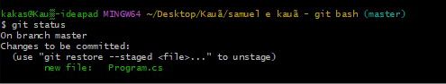
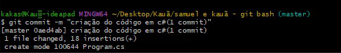

# PAM_Repositorio(Samuel e Kauã)
Repositório destinado para o exercício de GitBash
 
 
 

 
O comando "git init" é utilizado para inicar o software.
 

 
Os comandos "git config --global user.name "nome_usuario" " e "git config --global user.email usuario@gmail.com" são usados para definir o nome de usuario e o e-mail do mesmo, respectivamente.
 
 

 
O comando "git status" verifica a atual situação da pasta selecionada(verifica se os arquivos contidos e se eles estão adicionados).
 
 

 
o comando "git remote add (link do projeto)" adiciona remotamente o projeto ao repositório.
 
 

 
O comando "git pull" permite atualizar o repositório local com as mudanças do repositório remoto.
 
 

 
O comando "git add ." adiciona e salva o projeto a um futuro commit.
 
 

 
O comando "git status" verifica a atual situação da pasta selecionada(verifica se os arquivos contidos e se eles estão adicionados).
 
 

 
O comando "git commit -m" salva tudo que foi feito até o atual momento no projeto.
 
 

 

 
O comando "git clone" passa todos os arquivos contidos em um repositório para outro.
 
 

 
Removemos uma imagem do repositório para atualizá-lo.
 
 

 
Deletamos o arquivo do código para passá-lo da máquina para o git.
 
 

 
O comando "git pull orgin" é usado para buscar os itens contidos no repositório local e passá-los para o remoto, assim, fazendo com que ambos fiquem iguais.
 
 

 

 
Selecionamos e deletamos o arquivo do código na máquina.
 
 

 
O comando "git reset" é usado para desfazer commits.
 
 

 
todos os arquivos do repositório retornam ao armazenamento da máquina.
 
 

Imagens adicionadas.
 
 

Código para enviar.
